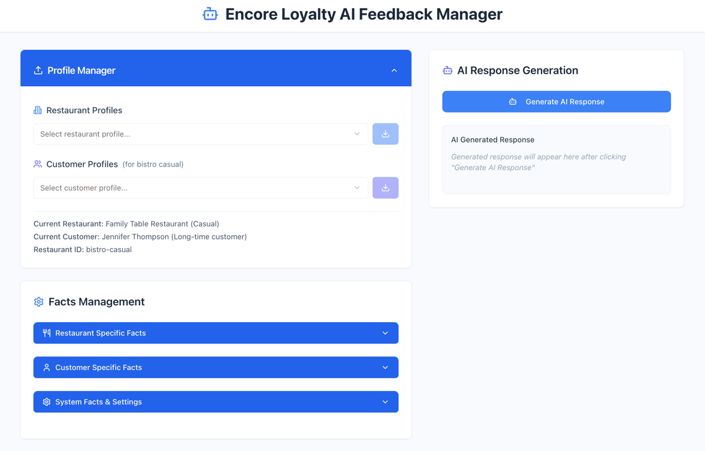

# Encore Loyalty AI Feedback Manager

A proof-of-concept system for restaurant customer feedback management and response generation using artificial intelligence.



## System Overview

The Encore Loyalty AI Feedback Manager is designed as a proof-of-concept for a larger customer relationship management system. The application demonstrates how AI can be integrated into business workflows to automate and enhance customer communication processes.

The system addresses a common operational challenge in the restaurant industry: generating contextually appropriate responses to customer feedback at scale. By maintaining structured data about restaurant characteristics, customer profiles, and system-wide configuration preferences, the application can produce personalized responses that account for multiple contextual factors.

The architecture implements a three-tier data model that captures essential context for response generation. Restaurant facts include operational details, brand characteristics, and service attributes. Customer facts encompass demographic information, visit history, and preferences. System facts define response parameters such as tone, length, and communication objectives.

The application serves as a demonstration of how AI-powered tools can augment human decision-making in customer service contexts while maintaining consistency with business requirements and brand guidelines.

## Core Functionality

### Profile Management System

The profile management component allows operators to load and switch between predefined restaurant and customer configurations. This system enables testing of different scenarios and demonstrates how contextual information affects response generation.

Restaurant profiles contain structured data about establishment type, location, service style, and brand characteristics. The system includes templates for various restaurant categories: casual dining establishments, family restaurants, quick-service operations, and fine dining venues. Each profile defines specific attributes that influence response tone and content.

Customer profiles represent different demographic segments and relationship stages. These profiles include information about visit frequency, dining preferences, age demographics, and historical interactions. The profile system demonstrates how customer segmentation can be used to customize communication strategies.

### Image Analysis and Data Extraction

The system includes computer vision capabilities for processing screenshots of customer feedback forms and reviews. This functionality addresses the practical challenge of extracting structured data from unstructured visual content.

The image analysis pipeline uses OpenAI's vision model to identify and extract specific data points from uploaded images. The system can recognize numerical ratings, text comments, demographic information, and other structured elements commonly found in customer feedback forms.

Extracted data is organized into categories with confidence levels indicating the reliability of each data point. This approach allows operators to verify critical information while automating the data entry process. The extracted facts are automatically integrated into the customer profile system for use in response generation.

### Response Generation Engine

The response generation component combines contextual data from multiple sources to produce appropriate customer communications. The system uses prompt engineering techniques to ensure that generated responses reflect the specific context of each interaction.

The generation process considers the original feedback content, customer profile information, restaurant characteristics, and system configuration parameters. This multi-factor approach enables the creation of responses that are both contextually appropriate and consistent with business requirements.

Response parameters can be configured for different scenarios, including length preferences, tone requirements, and specific content elements. The system supports various response styles ranging from brief acknowledgments to detailed explanations, depending on the context and configuration.

## Technical Implementation

### Frontend Architecture

The user interface is implemented using React with TypeScript, providing type safety and component reusability. The frontend uses a modular component structure that separates concerns and enables independent development of different interface elements.

The UI implementation includes drag-and-drop file handling for image uploads, collapsible sections for workflow organization, and real-time feedback during processing operations. Component state management is handled through React hooks, with external state managed via TanStack Query for server communication.

Styling is implemented using TailwindCSS with a custom component library based on shadcn/ui. This approach provides consistent visual design while maintaining flexibility for customization and extension.

### Backend Services

The server implementation uses Express.js to provide REST API endpoints for all system operations. The backend architecture separates different functional areas into distinct route handlers and service modules.

The server handles multiple types of operations: configuration management, profile loading and switching, AI service integration, image processing, and data persistence. Each operation is implemented as a separate endpoint with appropriate error handling and validation.

Data persistence is currently implemented using JSON file storage, which provides simplicity for development and testing while maintaining clear data structure and easy backup capabilities.

### AI Integration

The system integrates with OpenAI's GPT-4o model for both text generation and image analysis tasks. The integration includes prompt engineering strategies designed to optimize output quality and consistency.

For image analysis, the system uses the vision capabilities of GPT-4o to extract structured data from visual content. The prompts are specifically designed to identify common elements in customer feedback forms and surveys.

Text generation uses carefully constructed prompts that incorporate all relevant contextual information while providing clear instructions for response style and content requirements. The prompts include placeholder substitution for dynamic content and length guidelines for different response types.

## Installation and Setup

### System Requirements

- Node.js version 16 or higher
- npm package manager
- OpenAI API account with GPT-4o access

### Installation Steps

1. **Repository Setup**

   ```bash
   git clone [repository-url]
   cd encore-loyalty-ai-feedback-manager
   npm install
   ```
2. **Environment Configuration**
   Create a `.env` file in the project root:

   ```env
   OPENAI_API_KEY=your_openai_api_key_here
   NODE_ENV=development
   ```
3. **Development Server**

   ```bash
   npm run dev
   ```

   Access the application at `http://localhost:4000`
4. **Production Deployment**

   ```bash
   npm run build
   npm start
   ```

## Usage Patterns

### Basic Operations

The typical workflow begins with loading appropriate restaurant and customer profiles that match the feedback scenario being processed. The profile selection determines the contextual framework for response generation.

For image-based feedback, operators upload screenshots to the designated interface area. The system processes the image, extracts relevant data points, and displays the results for verification. Extracted information is automatically added to the customer profile for use in response generation.

For text-based feedback, operators input the customer comments directly and initiate the response generation process. The system considers all available contextual information to produce an appropriate response.

### Configuration Management

System behavior can be customized through various configuration parameters. Response length can be set to brief, moderate, or detailed depending on the communication requirements. Response tone can be adjusted from formal to casual based on brand guidelines and customer segment.

The system supports template-based response elements that ensure consistency across different interactions while maintaining personalization for specific situations. These templates can be customized to reflect specific business requirements and communication standards.

## API Documentation

### Configuration Endpoints

- `GET /api/fact-configuration` - Retrieve current system configuration
- `POST /api/fact-configuration` - Update configuration parameters

### AI Processing Endpoints

- `POST /api/generate-response` - Generate personalized responses
- `POST /api/analyze-image` - Extract text from uploaded images
- `POST /api/analyze-feedback-screenshot` - Extract structured data from feedback images

### Profile Management Endpoints

- `GET /api/restaurant-profiles` - List available restaurant profiles
- `GET /api/customer-profiles/:restaurantId` - List customer profiles for specific restaurant
- `POST /api/load-restaurant-profile` - Load specific restaurant configuration
- `POST /api/load-customer-profile` - Load specific customer configuration

### Response Management Endpoints

- `POST /api/save-response` - Store generated responses
- `POST /api/email-response` - Send responses to customers

## Data Architecture

### Profile Templates

The system includes predefined templates that represent common restaurant types and customer segments. These templates provide starting points for different operational scenarios and demonstrate the range of contexts the system can handle.

Restaurant templates include casual dining establishments with neighborhood focus, family-oriented restaurants with child-friendly features, quick-service operations with efficiency emphasis, and upscale dining venues with premium service characteristics.

Customer templates represent various demographic groups, visit frequency patterns, and relationship stages. These profiles help ensure that response generation appropriately matches customer expectations and communication preferences for different segments.

### Data Persistence

All system data is stored in structured JSON format, providing transparency and easy backup capabilities. The storage system maintains separate files for configurations, customer interactions, and generated responses.

This approach enables clear audit trails and allows for easy data migration or integration with other systems. The JSON format also provides flexibility for schema evolution as system requirements change.

## Future Development Considerations

This proof-of-concept demonstrates core functionality that could be extended in several directions. Integration with popular review platforms could enable automatic response posting. Sentiment analysis capabilities could provide trending insights for operational improvements.

Machine learning approaches could enable the system to learn customer communication preferences over time, improving personalization effectiveness. Multi-language support could extend the system's applicability to diverse customer bases.

The modular architecture supports extension and modification of individual components without affecting the overall system. This design approach enables incremental development and deployment of new features.

## Contributing

Contributions are welcome from developers interested in AI applications, user interface design, or restaurant industry domain expertise. The codebase follows standard React and Express.js patterns, making it accessible to developers familiar with these technologies.

Areas for contribution include AI prompt optimization, user interface enhancements, additional profile templates, and integration capabilities with external systems.

## License

This project is available under the MIT License, providing flexibility for modification and distribution while maintaining attribution requirements.

---

*Encore Loyalty AI Feedback Manager: A technical demonstration of AI-powered customer communication systems.*
